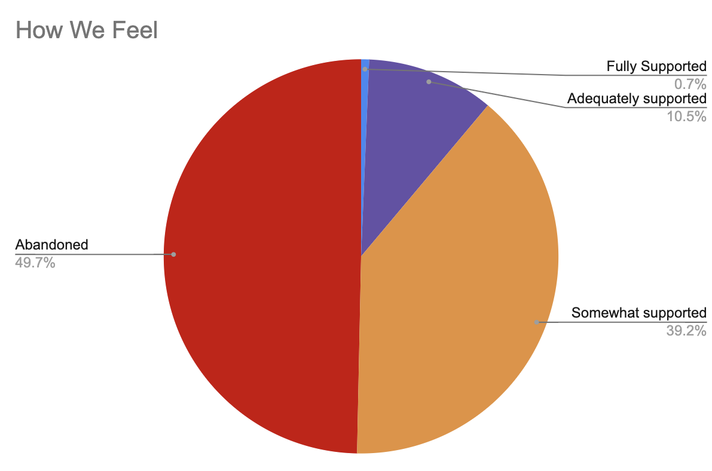

# making a box

  

    
    
    
    
  

  

    
    
    
    
  

  

    
    
    
    
  

  

    
    
    
    
  

<h2>Opacity with Box</h2>

Hover over the image to see the effect.

  
  

    
John Doe

  

<!-- JAVASCRIPT?
 -->
<button onclick="one()">1</button>
<button onclick="two()">2</button>
<button onclick="four()">4</button>

