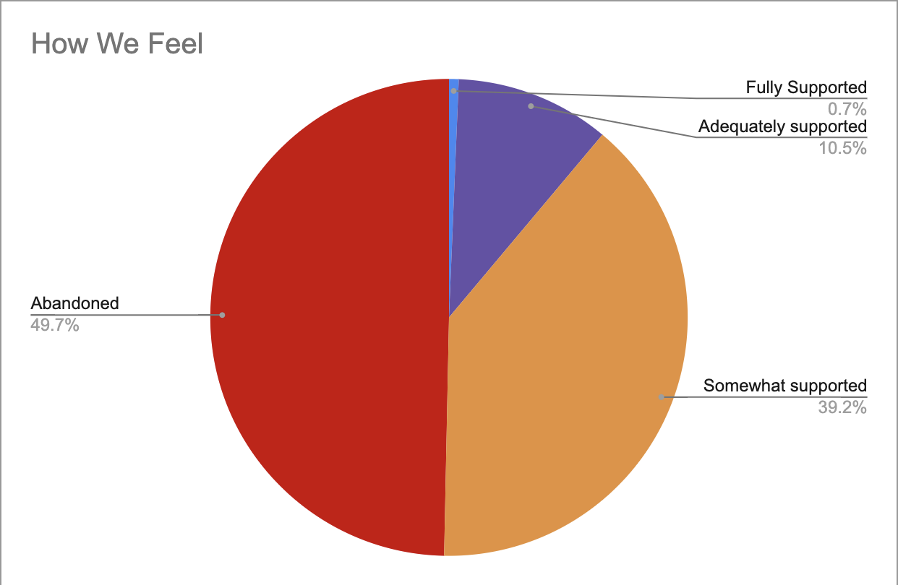

# Join the initiative

We're collecting data on caregiver experiences at universities across the United States and internationally.

[Fill out the survey here.](https://docs.google.com/forms/d/e/1FAIpQLSc6iRSlr7DJXthJwENxXTjTa3jPiFVqOI9RsNqu-1LZbhw2Xg/viewform)  

[View preliminary responses here](ttps://docs.google.com/spreadsheets/d/1eQhgq3aKu699FWvimjtBMzLPnJIekMlVBFw1DAyrW18/edit?usp=sharing)

# What we've learned
We're still in the process of collecting and validating data. But events are moving too quickly for us to sit by and wait, so we're posting preliminary information in real time as we receive it. 

Last update: October 13, 2020.

## 1. Institutions aren't doing enough
We identified sixteen different ways that institutions can support caregivers, ranging from acknowledging the emotional costs of caregiving to offering work from home, FMLA leave, or financial support.  

[View the responses, broken down by institution, here.](https://docs.google.com/spreadsheets/d/1eQhgq3aKu699FWvimjtBMzLPnJIekMlVBFw1DAyrW18/edit?usp=sharing)

We asked respondents which of those sixteen modes of support they had received from their institutions. *The numbers overwhelmingly show that institutions are not offering most, if any, of these provisions.*

Workers from only 41% of institutions reported having the option of work from home or flexible work schedules.

Only 16% reported FMLA mandated leave, while a mere 17% reported that their institutions had acknowledged the emotional impact of caregiving on their workers.

### Caveats
* We only asked for positive responses, not negative responses, so we don't know for sure that institutions aren't providing other resources to some of their staff. 
* We didn't break down the data by position, though we know that people in different kinds of jobs received wildly different options. 
If your experience differs from what is being reported, feel free to complete the survey yourself.

### Other accommodations
A number of respondents described other ways that they are being supported that are not included in the survey, such as:
* Ability to delay / take early scheduled leave
* Ability to manipulate policies on behalf of supervisees
* Assignment of TAs or RAs
* Reduced service responsibilities
* Nothing, Absolutely nothing, nothing at all.
* "I was forced to quit."

## 2. Caregivers feel abandoned by their institutions

We asked caregivers to answer the question: "How do you feel about your university's caregiver policies during the pandemic?"

Respondents could choose between Abandoned (49.7%), Somewhat Supported (39.2%), Adequately Supported (10.5%), and Fully Supported (0.7%).  

*Overwhelmingly, respondents felt under-supported by their institutions.* We're not going to lie: it's painful to see how many of you feel fully abandoned by your workplace.  

## 3. Caregivers are struggling

We left a space for further comments and so, so many of you shared heartbreaking stories of your struggles. We are thinking of ways to meaningfully share this information, but here are just a few examples:
* "While I can do my job from home I don't think I'll be allowed to. I feel totally abandoned by the university and like they will just want me to quit, which I can't afford."
* "There is absolutely no support whatsoever for caregivers that do not fit normative ideals of what families look like. We are struggling."
* "Caregiving knows no age boundaries, and can be needed at any time. American policies on family care are not only unfair, but they almost entirely ignore care for ADULTS as a responsibility."
* "The scope of care giving responsibilities have changed in our home in ways that are not legible to the institution."
* "I can't express how completely abandoned I feel by my university even as it produces research that demonstrates how care giving has impacted women's mental health."
* "We are also furloughed."
* "The desperation is real and pressing."

## 4. About our respondents

Our respondents so far have largely been securely employed, and a majority are concerned with childcare, though a number of you have adults or elders who you care for as well. Student workers, as well as contingent and precarious workers, are underrepresented in this survey, perhaps because they don't have time to take it. 

The majority of respondents (about 40%) are caring for one or more child age 6-12, while about 20% are caring for adults.  
 

 
 
The majority of respondents (about 40%) are tenured faculty, followed by tenure track faculty, administrative staff, or permanent librarians. 

 
 
More than 60% of respondents are in permanent roles, which means their jobs don't have a fixed end date. About twenty percent are on term-limited contracts, while the remainder are precarious (i.e. adjuncting) or students.  

