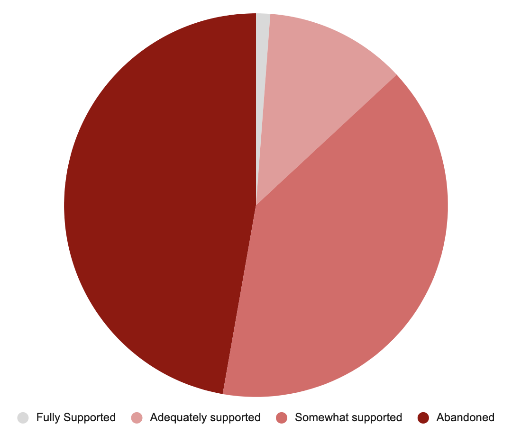
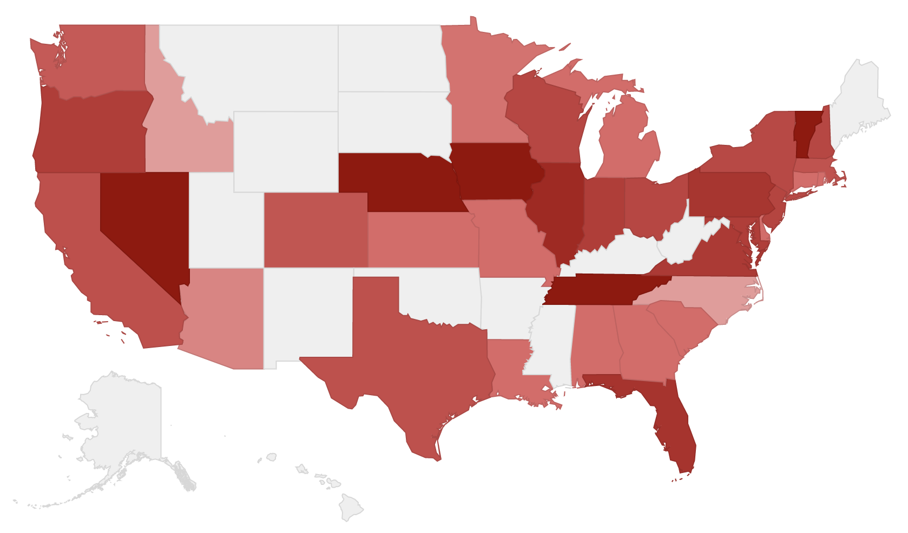
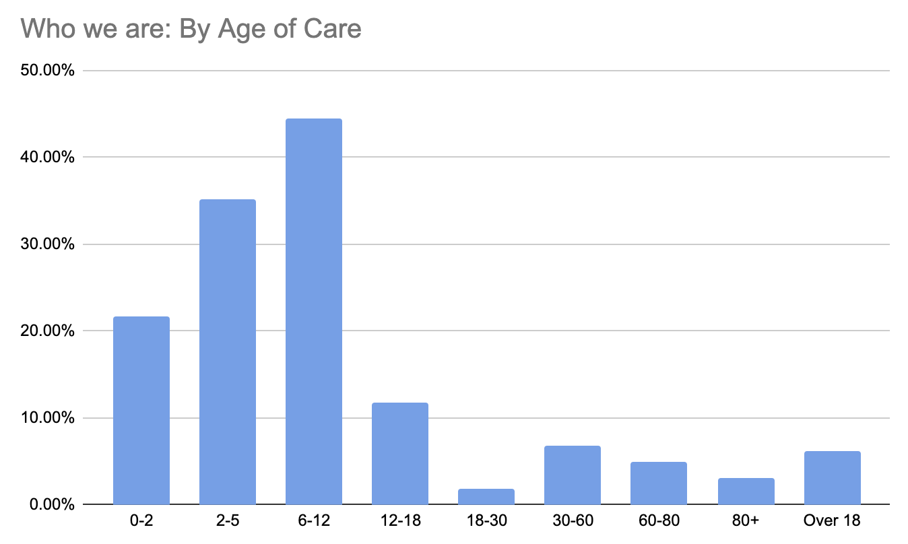
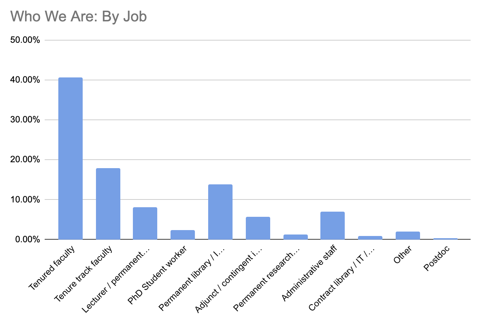
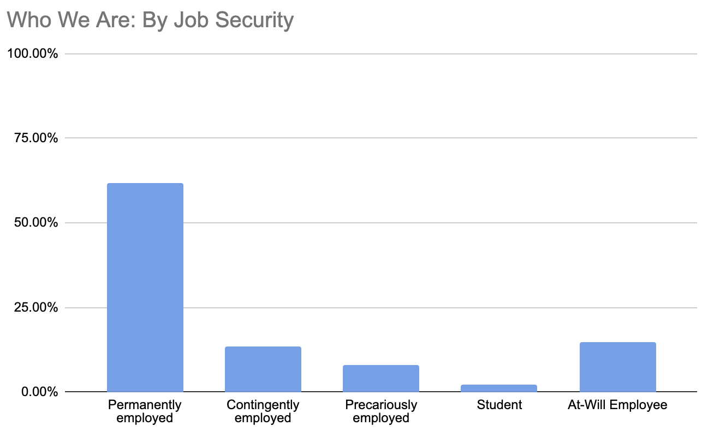

# Welcome to the Caregivers Survey

A VFC effort to bring visibility to working conditions for caregivers on campuses during the coronavirus pandemic.

Caregivers are people who have at-home care responsibilities: for children, for parents, for siblings, for partners, for other loved ones. With the collapse of external caregiving resources, like schools, elder-care facilities, and offices, many of us are being asked to shoulder an impossible burden: full-time care and full-time work.

This project focuses on the students and staff who are serving as caregivers while working on college campuses, from TAs to tenured professors, librarians, adjunct instructors, and administrative staff.  

<a href="https://docs.google.com/forms/d/e/1FAIpQLSc6iRSlr7DJXthJwENxXTjTa3jPiFVqOI9RsNqu-1LZbhw2Xg/viewform?usp=sf_link">Take the survey. </a> View a summary of preliminary results below.

# 1. Caregivers feel abandoned by their institutions

We asked caregivers to answer the question: "How do you feel about your university's caregiver policies during the pandemic?"

Here's what you told us.

<!-- 

Respondents could choose between Abandoned (47.22%), Somewhat Supported (39.68%), Adequately Supported (11.9%), and Fully Supported (1.19%).  

We're not going to lie: it's painful to see how many of you feel fully abandoned by your workplace. 
 -->

  

    <h2>How we feel</h2>
	    

	    
Overwhelmingly, caregivers feel undersupported by their institutions. Your responses: Abandoned (47.22%), Somewhat Supported (39.68%), Adequately Supported (11.9%), and Fully Supported (1.19%).  

  

  
<!-- 
 -->
  

    <h2>Feelings across the US</h2>
    

    
We've received responses from most of the United States as well as Mexico, Canada, and around the globe. This image shows responses across the U.S. The darker the state, the more abandoned our respondents feel.

  

 
<!-- 

 -->

# 2. Institutions aren't doing enough
We asked caregivers what actions their institutions were taking to support them. 

View results organized by institution in our [Caregiving Spreadsheet](https://docs.google.com/spreadsheets/d/1eQhgq3aKu699FWvimjtBMzLPnJIekMlVBFw1DAyrW18/edit?usp=sharing).

View a summary of results below. Actions taken by more than 1/3 of institutions are highlighted in blue.
## Logistical or Financial Support
<table>
	<tr>
		<th>Act of support</th>
		<th>Percent of institutions taking action</th>
	</tr>
	<tr>
		<td>Financial support to help pay for professional care, like childcare or in-home help</td>
		<td>4.96%</td>
	</tr>
	<tr>
		<td>Financial support for technology or equipment necessary for caregiving</td>
		<td>4.96%</td>
	</tr>
	<tr>
		<td>Other financial support related to caregiving</td>
		<td>0%</td>
	</tr>
	<tr>
		<td>Campus-provided childcare</td>
		<td>7.44%</td>
	</tr>
	<tr>
		<td>Logistical support in finding caregiving services, like pods</td>
		<td>6.61%</td>
	</tr>
</table>

## Scheduling and Workload Support
<table>
<!-- 	<caption>Summary of actions taken by universities to support caregivers.</caption> -->
  <thead>
    <tr>
      <th scope="col">Act of support</th>
      <th scope="col">Percent of institutions taking action</th>
    </tr>
  </thead>
<tbody>
	<tr>
		<td>FMLA leave under the provisions of the FFCRA act</td>
		<td>28.93%</td>
	</tr>
	<tr>
		<td>Option to work fewer hours for less pay</td>
		<td>20.66%</td>
	</tr>
	<tr>
		<td>Option to work fewer hours with the same pay</td>
		<td>8.26%</td>
	</tr>
	<tr style="background-color:#87CEFA">
		<td>Work from home options & flexible work schedules for caregivers</td>
		<td>68.60%</td>
	</tr>
	<tr>
		<td>For instructors: course buyouts for caregiving</td>
		<td>4.96%</td>
	</tr>
	<tr>
		<td>For students: increased time to degree to accommodate caregiving</td>
		<td>3.31%</td>
	</tr>
	<tr style="background-color:#87CEFA">
		<td>For tt workers: paused tenure clocks for caregiving</td>
		<td>42.15%</td>
	</tr>
	<tr>
		<td>Ability to take early or delay scheduled leave</td>
		<td>8.26%</td>
	</tr>
	<tr>
		<td>For instructors: Additional TAs or RAs to reduce workload</td>
		<td>2.48%</td>
	</tr>
</tbody>
</table>

## Communicative and Emotional Support
<table>
	<tr>
		<th>Act of support</th>
		<th>Percent of institutions taking action</th>
	</tr>
	<tr>
		<td>Clear communication about caregiving policies and expectations</td>
		<td>17.36%</td>
	</tr>
	<tr style="background-color:#87CEFA">
		<td>Acknowledgement of the emotional costs of caregiving</td>
		<td>41.32%</td>
	</tr>
	<tr>
		<td>Acknowledgement of the racial and gendered impact of caregiving on careers and a stated commitment to addressing those impacts.</td>
		<td>19.01%</td>
	</tr>
</table>

<!-- 
We identified sixteen different ways that institutions can support caregivers, ranging from acknowledging the emotional costs of caregiving to offering work from home, FMLA leave, or financial support.  

[View the responses, broken down by institution, here.](https://docs.google.com/spreadsheets/d/1eQhgq3aKu699FWvimjtBMzLPnJIekMlVBFw1DAyrW18/edit?usp=sharing)

We asked respondents which of those sixteen modes of support they had received from their institutions. *The numbers overwhelmingly show that institutions are not offering most, if any, of these provisions.*

Workers from only 41% of institutions reported having the option of work from home or flexible work schedules.

Only 16% reported FMLA mandated leave, while a mere 17% reported that their institutions had acknowledged the emotional impact of caregiving on their workers.

### Other accommodations
A number of respondents described other ways that they are being supported that are not included in the survey, such as:
* Ability to delay / take early scheduled leave
* Ability to manipulate policies on behalf of supervisees
* Assignment of TAs or RAs
* Reduced service responsibilities
* Nothing, Absolutely nothing, nothing at all.
* "I was forced to quit."

### Caveats
* We only asked for positive responses, not negative responses, so we don't know for sure that institutions aren't providing other resources to some of their staff. 
* The spreadsheet summarizes the responses by institution, and omits responses that don't name an institution. We are working on ways to provide a more complete picture of responses.
* We didn't break down the data by position, though we know that people in different kinds of jobs received wildly different options. 
If your experience differs from what is being reported, feel free to complete the survey yourself. -->

# 3. Caregivers are struggling

<!-- We left a space for further comments and so, so many of you shared heartbreaking stories of your struggles. We are thinking of ways to meaningfully share this information, but here are just a few examples:
* "While I can do my job from home I don't think I'll be allowed to. I feel totally abandoned by the university and like they will just want me to quit, which I can't afford."
* "There is absolutely no support whatsoever for caregivers that do not fit normative ideals of what families look like. We are struggling."
* "Caregiving knows no age boundaries, and can be needed at any time. American policies on family care are not only unfair, but they almost entirely ignore care for ADULTS as a responsibility."
* "The scope of care giving responsibilities have changed in our home in ways that are not legible to the institution."
* "I can't express how completely abandoned I feel by my university even as it produces research that demonstrates how care giving has impacted women's mental health."
* "We are also furloughed."
* "The desperation is real and pressing."
 -->

  

	

	  
	  

	    
 Obviously junior faculty will fear retribution for asking for or taking any accommodations.

	  

	

  

  

	

	  
	  

	    
There has been lip service but very little change in policy.

	  

	

  

  

	

	  
	  

	    
I'm a single parent with two kids virtually schooling from home. My research goals are feeling unobtainable.

	  

	

  

  

	

	  
	  

	    
 The very structure of adjunct labor means that very little support is even institutionally possible ... and most of the kinds of support that people are agitating for would not apply to me.

	  

	

  

  

	

	  
	  

	    
It's clear that I will not be able to complete sufficient research to be granted tenure under the circumstances, so I must seek a career change.

	  

	

  

  

	

	  
	  

	    
Caring for an ailing and high-covid-risk parent during a pandemic-interrupted PhD program? I feel like I need far more than anything that the concept of "acommodation" can provide.

	  

	

  

  

	

	  
	  

	    
 The failure, at a human level, to even acknowledge the situation of caregivers is devastating.

	  

	

  

  

	

	  
	  

	    
We have received literally ZERO communication to date acknowledging the demands facing faculty and staff with care-giving responsibilities.

	  

	

  

  

	

	  
	  

	    
Affordable childcare would change our lives so much, I can’t even say. We have twins & full time care is at least $48,000 a year which I can’t even believe typing it out. 

	  

	

  

  

	

	  
	  

	    
 My university has created a confusing system by which faculty have to rely on the individual good will of their department chairs rather than making an equitable, across-the-board solution. It is infuriating.

	  

	

  

  

	

	  
	  

	    
Upon asking for concrete and immediate support on behalf of my colleagues in more precarious situations, I was instead asked to lead a task force.

	  

	

  

  

	

	  
	  

	    
I am working 15-hour days at best and still can barely do my job; this is unsustainable. 

	  

	

  

  

	

	  
	  

	    
 I think my department has done a great job acknowledging the impact of caregiving. However, there are limits to tangible actions that can be taken at the departmental level.

	  

	

  

  

	

	  
	  

	    
One of my children is disabled and needs 24 hour care.

	  

	

  

  

	

	  
	  

	    
The desperation is real and pressing. 

	  

	

  

  

	

	  
	  

	    
 It’s been a huge hassle getting FMLA, and I feel enormous pressure to not take as much FMLA as I actually need.

	  

	

  

  

	

	  
	  

	    
As soon as daycare reopened, it was back to business as usual for faculty.

	  

	

  

  

	

	  
	  

	    
Can we get an expose on how bullshit the FMLA-FFCRA is? 

	  

	

  

  

	

	  
	  

	    
 We have circulated a petition to the university and over a month later there has been no public statement and no specific accommodations or supports.

	  

	

  

  

	

	  
	  

	    
We are also furloughed. Although we are doing more teaching work to teach remotely, we have taken a pay cut.

	  

	

  

  

	

	  
	  

	    
Because we are able to be at home, everyone just assumes we must be okay. But it’s impossible to get any serious work done. 

	  

	

  

  

	

	  
	  

	    
 I was actually laid off as a result of having taken a semester off of adjunct teaching to do research and take care of my children.

	  

	

  

  

	

	  
	  

	    
My supervisor lets me work from home, but that just means the days tend to be very long.

	  

	

  

  

	

	  
	  

	    
I feel that everyone is like "I don't know how you have been doing this" but there is no actual accommodation or acknowledgement of emotional burnout. 

	  

	

  

  

	

	  
	  

	    
 If I didn't already have tenure, I would be utterly, utterly screwed.

	  

	

  

  

	

	  
	  

	    
It’s been challenging to work while homeschooling. Really tough.

	  

	

  

  

	

	  
	  

	    
Deep divides in workplace between fac and staff, unionized and non-union, tenure and untenured, management non-union and rank-and-file non-union.  Suspicious that any care policies are based on the needs of fairly high-up managers.

	  

	

  

# About the survey

We're collecting data on caregiver experiences at universities across the United States and internationally.

<a href="https://docs.google.com/forms/d/e/1FAIpQLSc6iRSlr7DJXthJwENxXTjTa3jPiFVqOI9RsNqu-1LZbhw2Xg/viewform?usp=sf_link">View the survey. </a>

We're still in the process of collecting and validating data. But events are moving too quickly for us to sit by and wait, so we're posting preliminary information in real time as we receive it. 

Last update: October 24, 2020. Responses: 252. Institutions: 121.

## About the data

This data represents the results of a survey that has been circulated via social media since early October, 2020. The survey was updated once, on October 14, to collect more nuanced information. We are only showing results here that can be calculated across both versions.

Data about institutions has been combined and simplified. If a respondent wrote that an accommodation was available but not accessible, we did not report it. We only require one positive response, however, to consider an accommodation available, even if we received conflicting results (as was often the case when people with different job titles replied).

We received a lot of information that is not yet available on this website, including information from people who didn't specify an institution, and details about where resources are coming from. We're working on it.

Feel unrepresented by the data? [Fill out the survey yourself](https://docs.google.com/forms/d/e/1FAIpQLSc6iRSlr7DJXthJwENxXTjTa3jPiFVqOI9RsNqu-1LZbhw2Xg/viewform?usp=sf_link)and share it with your colleagues.

Want to help? email visionaryfuturescollective@gmail.com

## About the respondents

Our respondents so far have largely been securely employed, and a majority are concerned with childcare, though a number of you have adults or elders who you care for as well. Student workers, as well as contingent and precarious workers, are underrepresented in this survey, perhaps because they don't have time to take it. 

The majority of respondents (about 40%) are caring for one or more child age 6-12, while about 20% are caring for adults.  
 

 
 
The majority of respondents (about 40%) are tenured faculty, followed by tenure track faculty, administrative staff, or permanent librarians. 

 
 
More than 60% of respondents are in permanent roles, which means their jobs don't have a fixed end date. About twenty percent are on term-limited contracts, while the remainder are precarious (i.e. adjuncting), students, or at-will employees.  

<!-- # Take the Survey!

<iframe src="https://docs.google.com/forms/d/e/1FAIpQLSc6iRSlr7DJXthJwENxXTjTa3jPiFVqOI9RsNqu-1LZbhw2Xg/viewform?embedded=true" width="700" height="520" frameborder="0" marginheight="0" marginwidth="0">Loading…</iframe> -->

