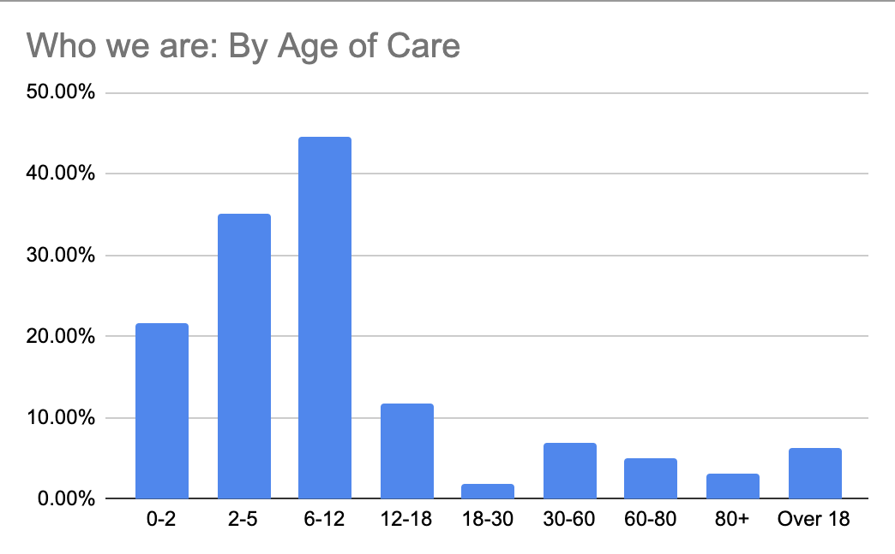
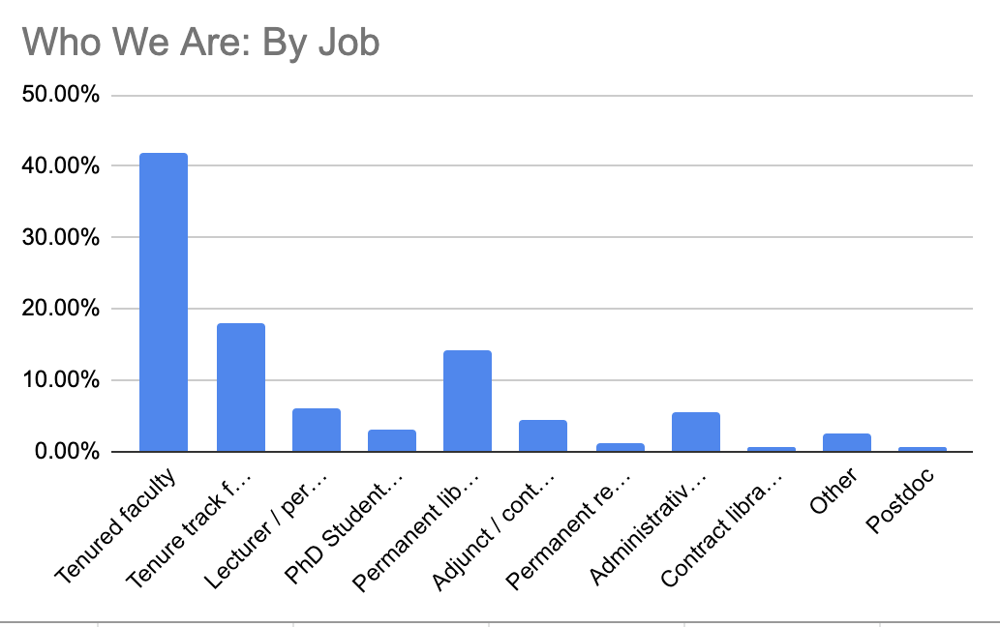
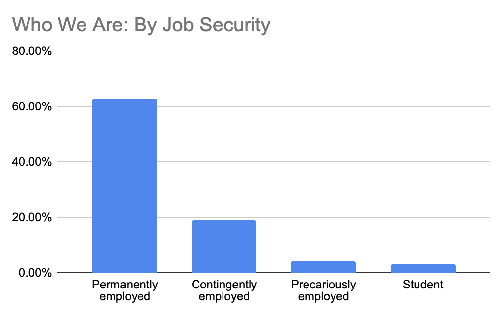

# Join the initiative

We're collecting data on caregiver experiences at universities across the United States and internationally.

<a href="https://docs.google.com/forms/d/e/1FAIpQLSc6iRSlr7DJXthJwENxXTjTa3jPiFVqOI9RsNqu-1LZbhw2Xg/viewform?usp=sf_link">View the survey. </a>

# What we've learned
We're still in the process of collecting and validating data. But events are moving too quickly for us to sit by and wait, so we're posting preliminary information in real time as we receive it. 

Last update: October 24, 2020. Responses: 252. Institutions: 121.

## 1. Institutions aren't doing enough
We identified sixteen different ways that institutions can support caregivers, ranging from acknowledging the emotional costs of caregiving to offering work from home, FMLA leave, or financial support.  

[View the responses, broken down by institution, here.](https://docs.google.com/spreadsheets/d/1eQhgq3aKu699FWvimjtBMzLPnJIekMlVBFw1DAyrW18/edit?usp=sharing)

We asked respondents which of those sixteen modes of support they had received from their institutions. *The numbers overwhelmingly show that institutions are not offering most, if any, of these provisions.* Read on to see what those provisions are... and where institutions are taking action (or falling short).

### Logistical or Financial Support
<table>
	<tr>
		<th>Act of support</th>
		<th>Percent of institutions taking action</th>
	</tr>
	<tr>
		<td>Financial support to help pay for professional care, like childcare or in-home help</td>
		<td>4.96%</td>
	</tr>
	<tr>
		<td>Financial support for technology or equipment necessary for caregiving</td>
		<td>4.96%</td>
	</tr>
	<tr>
		<td>Other financial support related to caregiving</td>
		<td>0%</td>
	</tr>
	<tr>
		<td>Campus-provided childcare</td>
		<td>7.44%</td>
	</tr>
	<tr>
		<td>Logistical support in finding caregiving services, like pods</td>
		<td>6.61%</td>
	</tr>
</table>

### Scheduling and Workload Support
<table>
	<tr>
		<th>Act of support</th>
		<th>Percent of institutions taking action</th>
	</tr>
	<tr>
		<td>FMLA leave under the provisions of the FFCRA act</td>
		<td>28.93%</td>
	</tr>
	<tr>
		<td>Option to work fewer hours for less pay</td>
		<td>20.66%</td>
	</tr>
	<tr>
		<td>Option to work fewer hours with the same pay</td>
		<td>8.26%</td>
	</tr>
	<tr>
		<td>Work from home options & flexible work schedules for caregivers</td>
		<td>68.60%</td>
	</tr>
	<tr>
		<td>For instructors: course buyouts for caregiving</td>
		<td>4.96%</td>
	</tr>
	<tr>
		<td>For students: increased time to degree to accommodate caregiving</td>
		<td>3.31%</td>
	</tr>
	<tr>
		<td>For tt workers: paused tenure clocks for caregiving</td>
		<td>42.15%</td>
	</tr>
	<tr>
		<td>Ability to take early or delay scheduled leave</td>
		<td>8.26%</td>
	</tr>
	<tr>
		<td>For instructors: Additional TAs or RAs to reduce workload</td>
		<td>2.48%</td>
	</tr>
</table>

### Communicative and Emotional Support
<table>
	<tr>
		<th>Act of support</th>
		<th>Percent of institutions taking action</th>
	</tr>
	<tr>
		<td>Clear communication about caregiving policies and expectations</td>
		<td>17.36%</td>
	</tr>
	<tr>
		<td>Acknowledgement of the emotional costs of caregiving</td>
		<td>41.32%</td>
	</tr>
	<tr>
		<td>Acknowledgement of the racial and gendered impact of caregiving on careers and a stated commitment to addressing those impacts.</td>
		<td>19.01%</td>
	</tr>
</table>

<!-- 
We identified sixteen different ways that institutions can support caregivers, ranging from acknowledging the emotional costs of caregiving to offering work from home, FMLA leave, or financial support.  

[View the responses, broken down by institution, here.](https://docs.google.com/spreadsheets/d/1eQhgq3aKu699FWvimjtBMzLPnJIekMlVBFw1DAyrW18/edit?usp=sharing)

We asked respondents which of those sixteen modes of support they had received from their institutions. *The numbers overwhelmingly show that institutions are not offering most, if any, of these provisions.*

Workers from only 41% of institutions reported having the option of work from home or flexible work schedules.

Only 16% reported FMLA mandated leave, while a mere 17% reported that their institutions had acknowledged the emotional impact of caregiving on their workers.

### Other accommodations
A number of respondents described other ways that they are being supported that are not included in the survey, such as:
* Ability to delay / take early scheduled leave
* Ability to manipulate policies on behalf of supervisees
* Assignment of TAs or RAs
* Reduced service responsibilities
* Nothing, Absolutely nothing, nothing at all.
* "I was forced to quit."

### Caveats
* We only asked for positive responses, not negative responses, so we don't know for sure that institutions aren't providing other resources to some of their staff. 
* The spreadsheet summarizes the responses by institution, and omits responses that don't name an institution. We are working on ways to provide a more complete picture of responses.
* We didn't break down the data by position, though we know that people in different kinds of jobs received wildly different options. 
If your experience differs from what is being reported, feel free to complete the survey yourself. -->

## 2. Caregivers feel abandoned by their institutions

We asked caregivers to answer the question: "How do you feel about your university's caregiver policies during the pandemic?"

Respondents could choose between Abandoned (47.22%), Somewhat Supported (39.68%), Adequately Supported (11.9%), and Fully Supported (1.19%).  

*Overwhelmingly, respondents felt under-supported by their institutions.* We're not going to lie: it's painful to see how many of you feel fully abandoned by your workplace. 

  

    <h2>How we feel</h2>
	    
</a>

	    
This chart shows how respondents feel about the support they are receiving. It is the most comprehensive data currently available, because it includes those who didn't name an institution and those based internationally.

  

  
<!-- 
 -->
  

    <h2>Feelings across the US</h2>
    
</a>

    
This chart shows how US-based respondents feel about the support they are receiving. The darker the color, the more abandoned the respondents. States for which we have no data are gray.

  

 

## 3. Caregivers are struggling

We left a space for further comments and so, so many of you shared heartbreaking stories of your struggles. We are thinking of ways to meaningfully share this information, but here are just a few examples:
* "While I can do my job from home I don't think I'll be allowed to. I feel totally abandoned by the university and like they will just want me to quit, which I can't afford."
* "There is absolutely no support whatsoever for caregivers that do not fit normative ideals of what families look like. We are struggling."
* "Caregiving knows no age boundaries, and can be needed at any time. American policies on family care are not only unfair, but they almost entirely ignore care for ADULTS as a responsibility."
* "The scope of care giving responsibilities have changed in our home in ways that are not legible to the institution."
* "I can't express how completely abandoned I feel by my university even as it produces research that demonstrates how care giving has impacted women's mental health."
* "We are also furloughed."
* "The desperation is real and pressing."

## 4. About our respondents

Our respondents so far have largely been securely employed, and a majority are concerned with childcare, though a number of you have adults or elders who you care for as well. Student workers, as well as contingent and precarious workers, are underrepresented in this survey, perhaps because they don't have time to take it. 

The majority of respondents (about 40%) are caring for one or more child age 6-12, while about 20% are caring for adults.  
 

 
 
The majority of respondents (about 40%) are tenured faculty, followed by tenure track faculty, administrative staff, or permanent librarians. 

 
 
More than 60% of respondents are in permanent roles, which means their jobs don't have a fixed end date. About twenty percent are on term-limited contracts, while the remainder are precarious (i.e. adjuncting) or students.  

[Note: this hasn't been updated since 10-13]

# Take the Survey!

<iframe src="https://docs.google.com/forms/d/e/1FAIpQLSc6iRSlr7DJXthJwENxXTjTa3jPiFVqOI9RsNqu-1LZbhw2Xg/viewform?embedded=true" width="700" height="520" frameborder="0" marginheight="0" marginwidth="0">Loading…</iframe>

